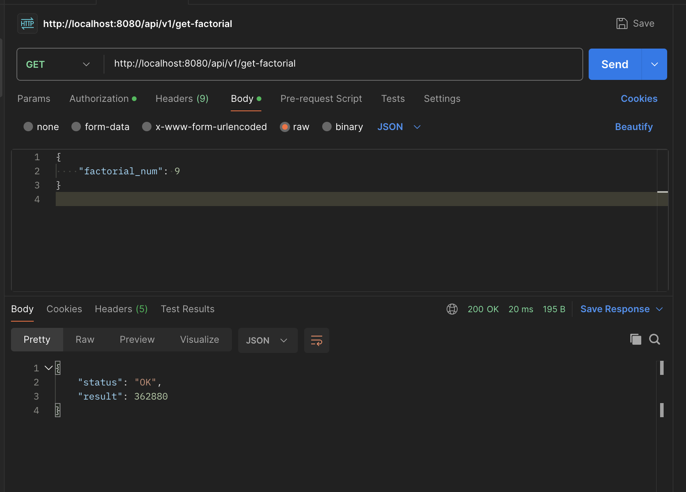

# SberProject

Сервис выдаёт факториал числа по API, максимальное значения спрашиваемого числа 100_000!. 
Включено кэширование запросов. 
Вывод метрик с помощью health, promerheus. 
Написаны тесты на разные корнер-кейсы. 
Добавлена сборка проекта с помощью Docker-a, что может значительно облегчить проверку сервиса.

Запуск докера осуществляется запуском команды из основной папки:
```
docker-compose up
```

И после этого по порту 8080 можно будет иметь доступ к нашему сервису.
Пример запроса:
```
http://localhost:8080/api/v1/get-factorial
```
и в _body_ передать:
```
{
    "factorial_num": 9
}
```
Скрин:


Метрики можно посмотреть запросом:
```
http://localhost:8080/actuator/prometheus
```
Также в проекте написаны тесты и предусмотрены разного рода ошибки
